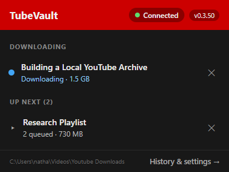
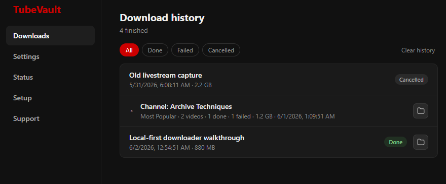
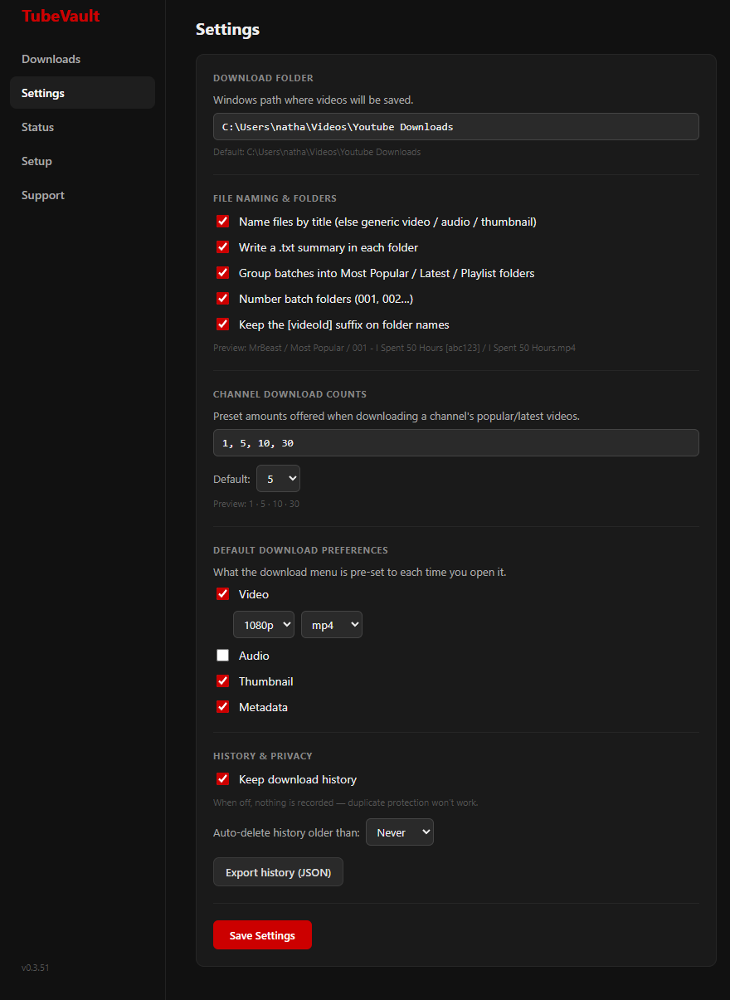
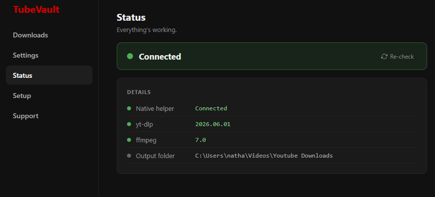
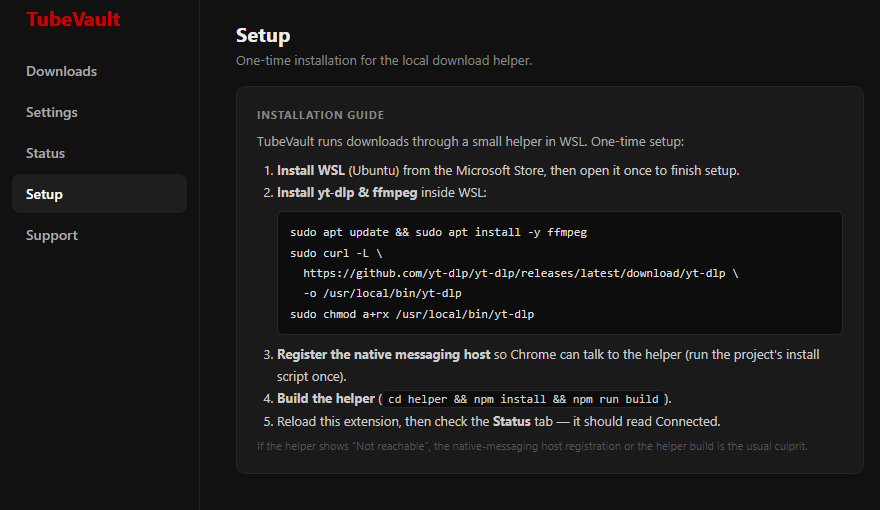
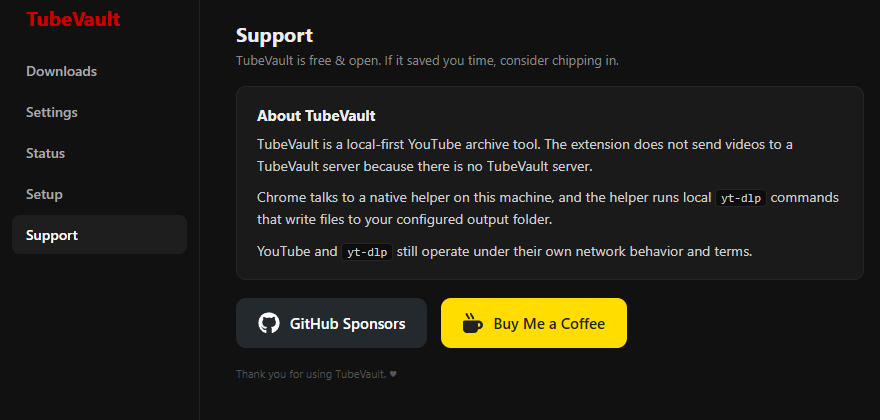

# TubeVault

TubeVault is a local-first Chrome extension for archiving YouTube videos, playlists, channels, thumbnails, and metadata to your own machine. The browser extension provides the YouTube UI, download queue, options page, history, setup/status panels, and support links. A WSL native messaging helper runs the actual local download work through `yt-dlp`.

Current Chrome extension version: **v0.3.51**

## What It Does

- Adds TubeVault archive controls to YouTube watch, Shorts, playlist, and channel pages.
- Supports video/audio/metadata/thumbnail component selection.
- Supports quality and format preferences.
- Expands playlist and channel requests into per-video jobs.
- Shows active downloads and queued work in the popup.
- Keeps finished download history in the options page.
- Saves locally through a native helper; no remote server is involved.
- Opens completed output folders from the options/history UI.

## Project Layout

```text
extension/          Chrome MV3 extension, React UI, service worker, content script
helper/             Node native messaging helper that calls yt-dlp in WSL
native-messaging/   Chrome native messaging host manifest
scripts/            Windows helper launcher and install script
DOWNLOADS_PLAN.md   Product and queue architecture plan
SETUP.md            Local install and troubleshooting guide
CHANGELOG.md        Version history
```

## Local Paths

Development source:

```text
/home/natkins/personal/tools/extensions/tube-vault
```

Chrome loads the unpacked extension from Windows:

```text
C:\Users\natha\Projects\Tools\tube-vault\extension
```

The helper build is copied to:

```text
C:\Users\natha\Projects\Tools\tube-vault\helper\dist
```

Default download output:

```text
C:\Users\natha\Videos\Youtube Downloads
```

## Setup

TubeVault is a Chrome extension plus a local WSL helper. The extension UI includes a **Setup** tab with the same core checklist, and [SETUP.md](SETUP.md) has the full local install and troubleshooting flow.

Short version:

```bash
npm install --prefix extension
npm install --prefix helper
npm run build --prefix helper
npm run build --prefix extension
```

Then run `scripts\install.ps1` from Windows PowerShell if the native messaging host needs to be registered, open `chrome://extensions`, enable Developer mode, load the Windows extension folder, and reload the unpacked extension after each build.

## Options Page

TubeVault's Chrome options page includes:

- **Downloads**: finished jobs, grouped batches, status filters, open-folder actions, and clear history.
- **Settings**: output root, naming layout, default download components, quality/format defaults, history retention, and channel count presets.
- **Status**: helper diagnostics, `yt-dlp`, `ffmpeg`, and output path checks.
- **Setup**: install checklist and local environment guidance.
- **Support**: support links and project links.

## Screenshots

### Popup

The popup is the "what is happening now" surface. It is intentionally compact: it shows the native-helper connection state, the current extension version, active downloads, queued batch groups, the configured local output folder, and the shortcut into history/settings. The popup is for monitoring and quick cancellation; completed work moves to the options-page history view.



### Downloads

The Downloads tab is the finished-history view. It separates history from the popup so the popup can stay focused on current work. Finished videos show status, file size, finish time, folder actions, and batch grouping. The filter chips make it easy to isolate done, failed, or cancelled work, and the clear-history action is kept here instead of in the popup.



### Settings

The Settings tab controls the defaults that shape every download. The output folder is a Windows path because Chrome and the native helper write to the Windows-visible filesystem. Naming controls decide whether downloads are grouped by category, numbered, given title-based file names, and paired with local summary files. Channel presets define the counts offered for popular/latest channel downloads. Default download preferences preselect video/audio/thumbnail/metadata options in the YouTube menu, and the history controls decide whether TubeVault keeps local history and how long it should be retained.



### Status

The Status tab is the local diagnostics surface. It checks whether Chrome can reach the native messaging helper, whether the helper can see `yt-dlp`, whether `ffmpeg` is available for media conversion, and which output folder the helper is using. This is the first place to look when downloads fail immediately or Chrome reports that the helper is not reachable.



### Setup

The Setup tab keeps the one-time install checklist inside the extension, so local helper setup is visible without returning to GitHub. It summarizes the WSL dependency install, native messaging registration, helper build, extension reload, and final Status-tab verification. The full version of this flow lives in [SETUP.md](SETUP.md).



### Support

The Support tab explains the local-first privacy model and exposes project support links. The About block states the important boundary: TubeVault has no server, Chrome talks to a native helper on this machine, and that helper runs local `yt-dlp` commands that write files to the configured output folder.



## Build Workflow

Extension build:

```bash
npm run build --prefix extension
```

This bumps `extension/package.json` and `extension/manifest.json`, bundles the extension with esbuild, copies built files to the Windows Chrome folder, and commits the extension build output.

Helper build:

```bash
npm run build --prefix helper
```

This compiles helper TypeScript and copies `dist/*.js` to the Windows helper path used by the native messaging launcher.

Screenshot capture:

```bash
npm run screenshots --prefix extension
```

This runs [scripts/capture-extension-screenshots.mjs](scripts/capture-extension-screenshots.mjs), which serves the built extension UI with a Chrome API shim and captures the popup plus every options tab through Puppeteer. See [docs/PUPPETEER_SCREENSHOTS.md](docs/PUPPETEER_SCREENSHOTS.md) for the workflow details.

## Support

- GitHub: <https://github.com/n8watkins/tube-vault>
- Issues: <https://github.com/n8watkins/tube-vault/issues>
- Support links in the extension options page are currently placeholders until final support URLs are configured.

## Privacy

TubeVault is local-first. It does not send videos to a TubeVault server because there is no TubeVault server. The extension talks to Chrome storage and the native helper; the helper runs local `yt-dlp` commands and writes files to your configured local output folder.

YouTube and `yt-dlp` still operate under their own network behavior and terms.

## Changelog

See [CHANGELOG.md](CHANGELOG.md).
