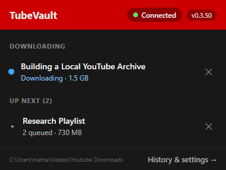
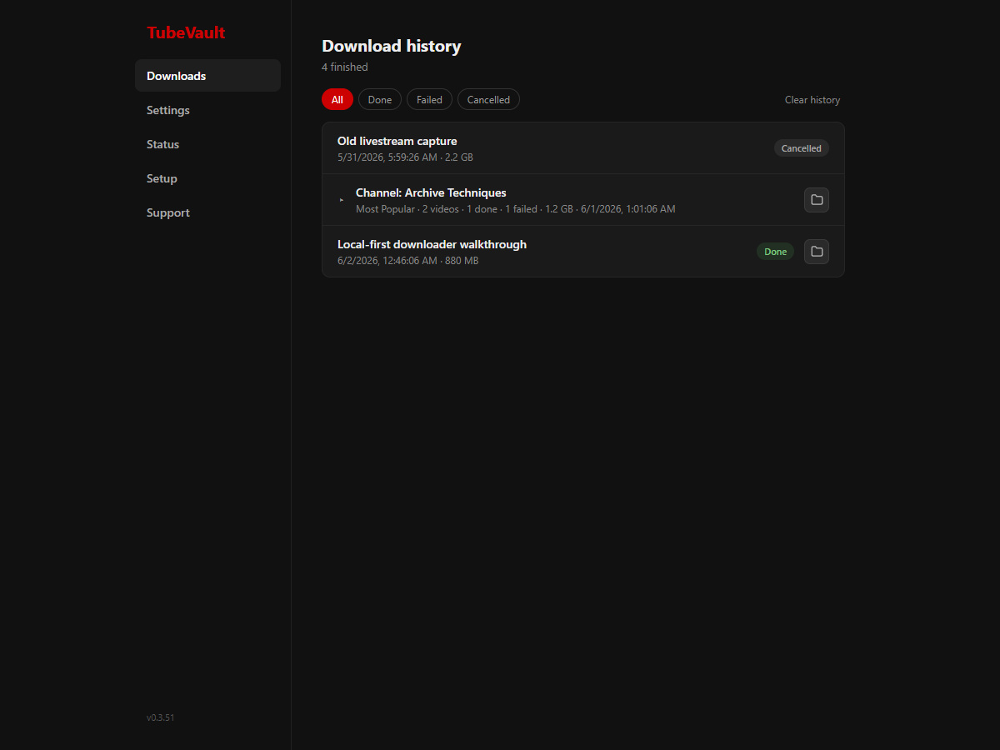
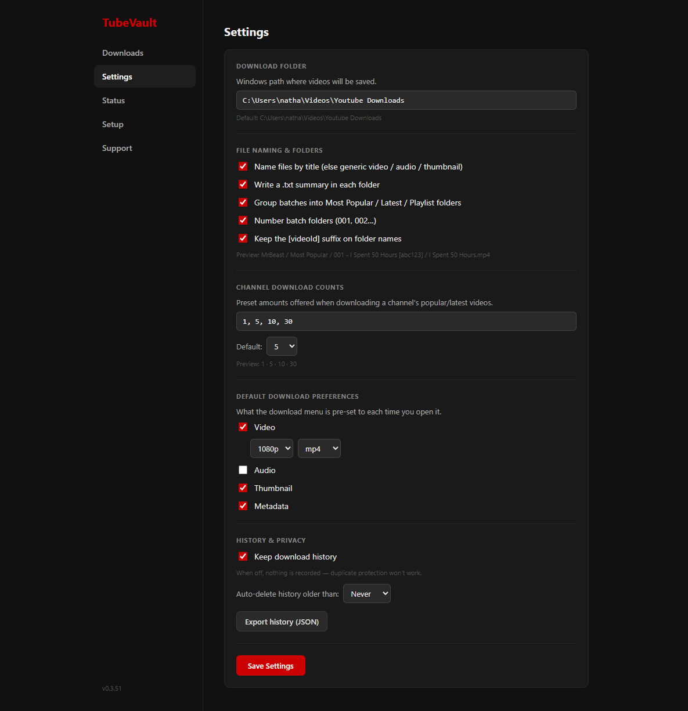
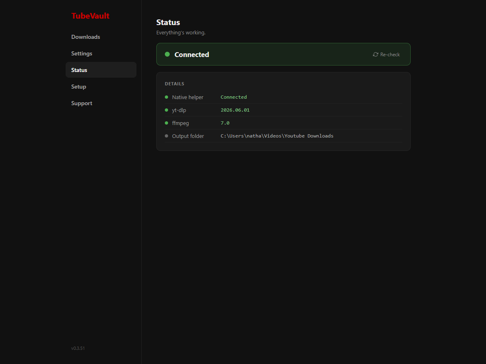
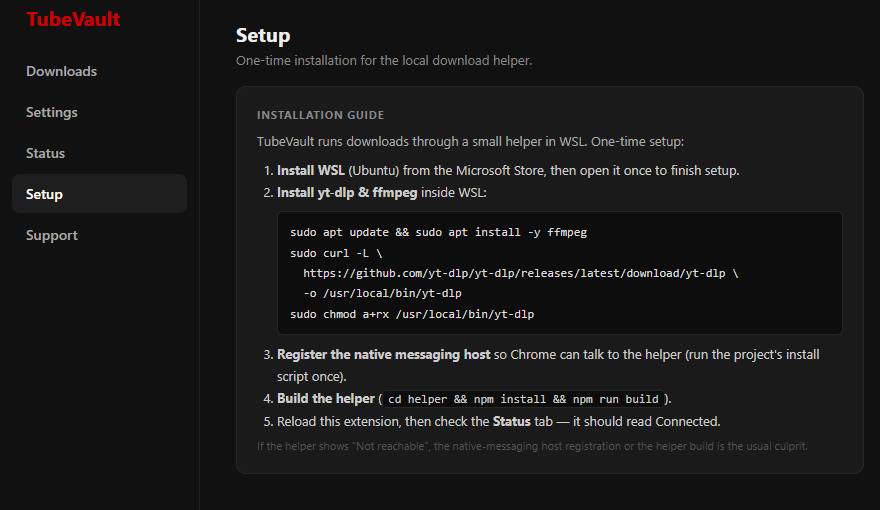

# TubeVault

TubeVault is a local-first Chrome extension for archiving YouTube videos, playlists, channels, Shorts, live videos, thumbnails, subtitles, audio, and metadata to your own machine.
The Chrome extension provides the YouTube controls, serial download queue, popup, history, settings, and diagnostics.
A local Node.js native messaging helper runs `yt-dlp` and `ffmpeg` without a TubeVault server.

## Features

- Adds download controls to YouTube watch, live, Shorts, playlist, mix, and channel pages.
- Selects video quality and format, audio format, subtitles, thumbnails, and metadata per request.
- Expands playlist and channel requests into individually selectable per-video jobs.
- Probes batch rows progressively for title, expected size, duration, and view count.
- Keeps downloads and queue-time probes serial, while planning and visible-row probes use bounded concurrency.
- Supports SponsorBlock chapter marking or explicit segment removal.
- Supports concurrent media fragments for faster individual downloads.
- Shows active work, queued batches, recent results, and cancellation controls in the popup.
- Stores optional local download history with retention controls, export, and a 100-item cap.
- Recovers safely when Chrome restarts the extension service worker during a queue.
- Uses a cross-platform helper on Windows with WSL, macOS, and Linux.
- Resolves a platform-appropriate default output folder without hardcoded usernames.

Browser-cookie access and parallel downloads of multiple videos are not implemented.
They remain deliberate backlog items because both require additional privacy, locking, and rate-limit safeguards.

## Project Layout

```text
extension/          Chrome MV3 extension, React UI, service worker, and content script
helper/             Node.js native messaging helper that calls yt-dlp and ffmpeg
native-messaging/   Native messaging host manifest template
scripts/            Build deployment, release, registration, and launcher scripts
tests/e2e/          Playwright Chromium smoke tests
SETUP.md            Installation and troubleshooting guide
```

## Install and Build

Install all three dependency sets from the repository root:

```bash
npm ci
npm ci --prefix extension
npm ci --prefix helper
```

Build both packages:

```bash
npm run build
```

The default build is portable and side-effect free.
It writes bundles only to `extension/dist` and `helper/dist`.
It does not change versions, copy to another checkout, stage files, commit, or push.

See [SETUP.md](SETUP.md) for native messaging registration and platform-specific prerequisites.

## Development Commands

```bash
npm run build       # Build extension and helper
npm run typecheck   # Type-check both packages
npm run lint        # Lint source, tests, and build scripts
npm test            # Run extension and helper unit tests
npm run test:e2e    # Build and run unpacked-extension Chromium smoke tests
npm run check       # Lint, type-check, unit test, and build
```

Install the bundled Playwright browser before the first local E2E run:

```bash
npx playwright install chromium
```

On Linux CI or a new Linux workstation, install Chromium and its system dependencies with:

```bash
npx playwright install --with-deps chromium
```

Watch all four extension entry points without release side effects:

```bash
npm run watch --prefix extension
```

## Explicit Windows Sync

Chrome on Windows cannot load an unpacked extension directly from the WSL Linux filesystem reliably.
Build and copy the runtime artifacts to an existing Windows checkout explicitly:

```bash
npm run sync:windows -- --target /mnt/c/Users/<you>/Projects/tube-vault
```

You can set `TUBE_VAULT_WINDOWS_REPO` instead of passing `--target`.
The CLI argument takes precedence when both are present.
The destination must be the absolute root of an existing Git repository with TubeVault extension and helper package identities.
The command copies only the extension manifest, HTML, icons, bundles, helper bundles, and helper package metadata.
It never deletes destination files.

Reload the unpacked extension at `chrome://extensions` after syncing.

## Patch Release

Create a local patch release commit with:

```bash
npm run release:patch
```

The release command requires clean tracked and staged files, while unrelated untracked files are allowed.
It verifies matching package, manifest, and lockfile versions, runs the full check, increments all four version records across those three files, rebuilds, stages those files, and commits `build(tube-vault): vX.Y.Z`.
It does not sync to Windows or push.

## Options Page

The options page has four tabs:

- **Downloads** contains finished history, grouped batches, filters, folder actions, JSON export, and history clearing.
- **Settings** controls the output root, naming, component defaults, quality and formats, notifications, history retention, SponsorBlock, faster fragments, thumbnails, and channel counts.
- **Status** checks the native helper, `yt-dlp`, `ffmpeg`, and resolved output path.
- **Setup** provides the one-time local helper checklist.

## Screenshots

### Popup

The popup focuses on current work, recent results, connection status, quick cancellation, and shortcuts to history and settings.



### Downloads

The Downloads tab provides local history and batch grouping without crowding the popup.



### Settings

The Settings tab controls download behavior, formats, naming, history, and advanced options.



### Status

The Status tab is the first place to inspect helper or local tool failures.



### Setup

The Setup tab keeps the core installation checklist available inside the extension.



## Privacy

TubeVault has no application server.
The extension uses Chrome storage and sends commands to the local native helper.
The helper runs local `yt-dlp` and `ffmpeg` processes and writes to the configured local folder.
YouTube and `yt-dlp` still operate under their own network behavior and terms.

## Changelog

See [CHANGELOG.md](CHANGELOG.md).
